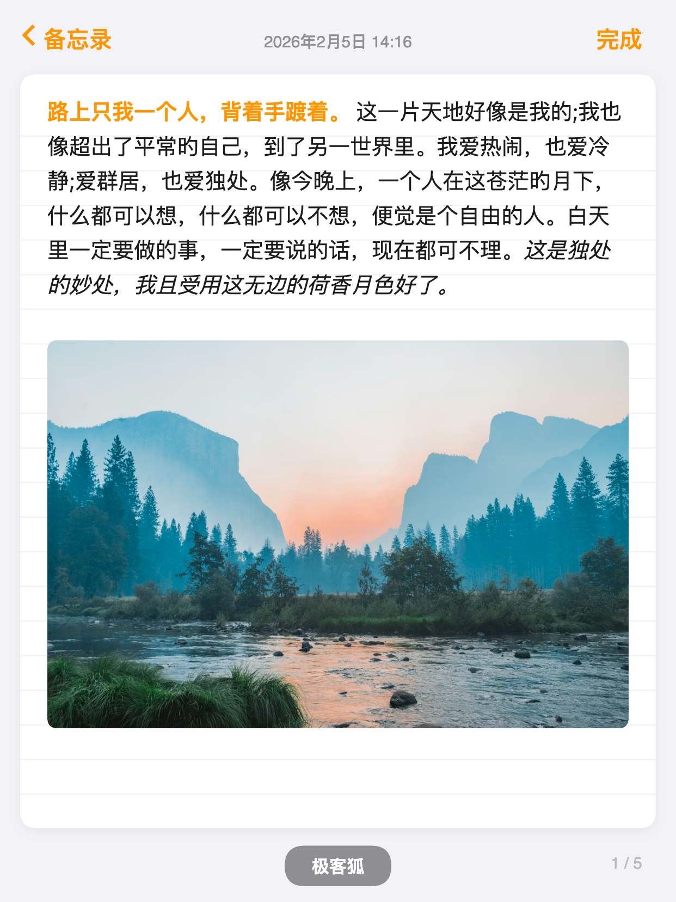
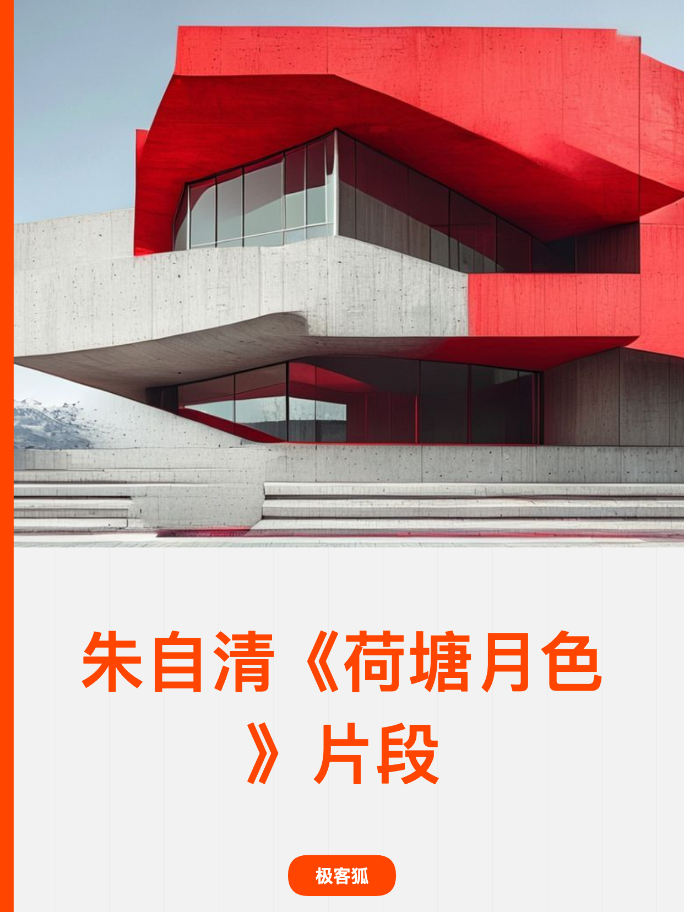
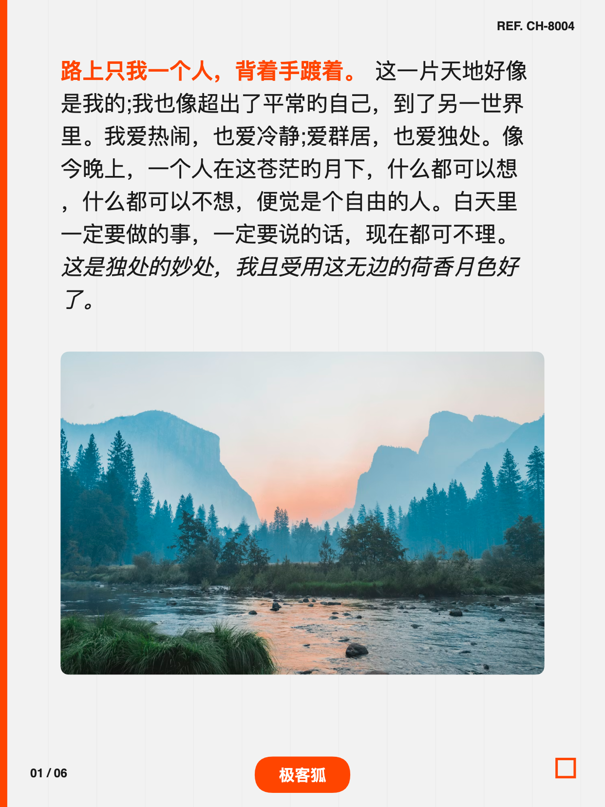
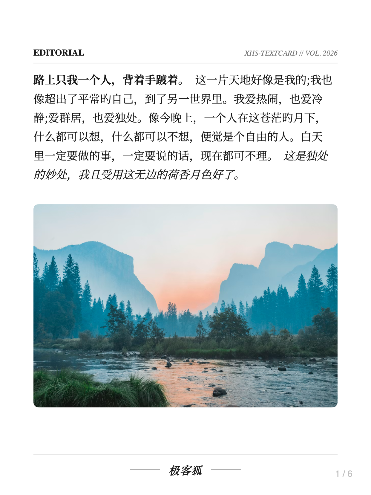
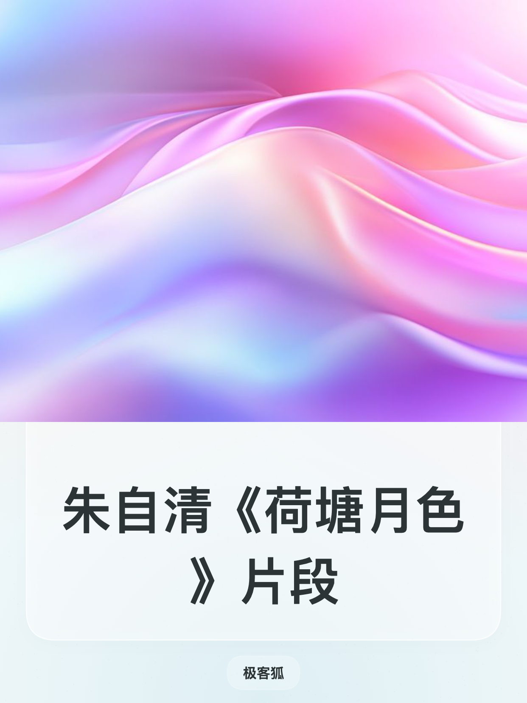
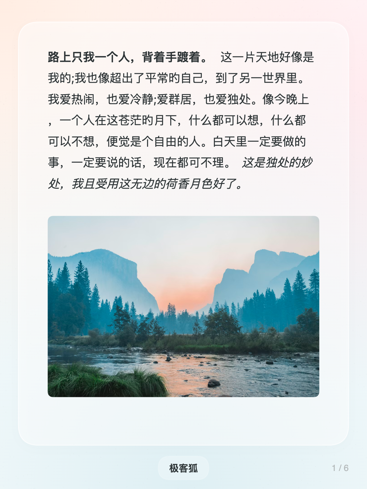
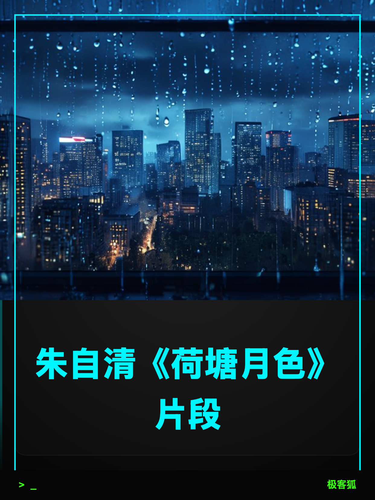
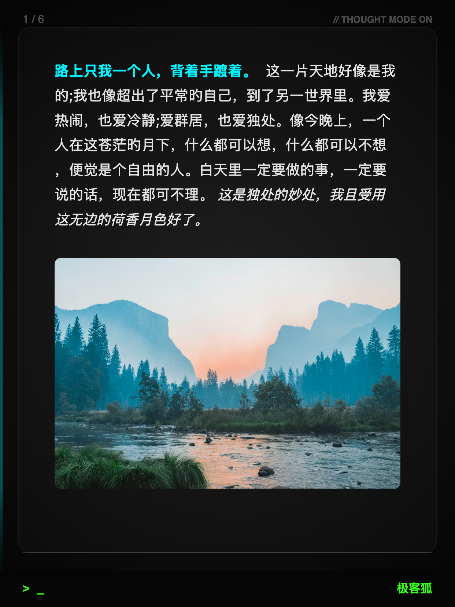
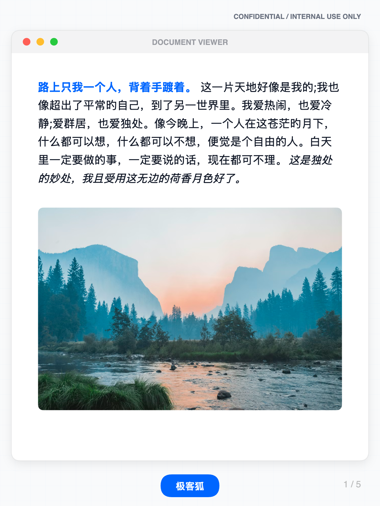

<div align="center">

<h1>XHS-TextCard 🎨</h1>

**专为小红书创作者打造的智能文字卡片生成工具**

一键将深度长文转化为排版精美的系列图片，打造**独一无二的个人 IP 视觉风格**

[](https://github.com/geekfoxcharlie/XHS-TextCard)
[](LICENSE)
[]()

🌐 **[在线演示](https://www.xhs-textcard.site)** | 📖 **[使用文档](#-快速开始)** | ⭐ **[点个 Star](https://github.com/geekfoxcharlie/XHS-TextCard)**

</div>

---

## ✨ 为什么选择 XHS-TextCard

作为小红书创作者，您是否遇到过这些困扰？

| ❌ 传统方式 | ✅ XHS-TextCard |
|:----------|:---------------|
| 手动分割图片耗时耗力 | **智能分页算法**，自动计算最佳分割点 |
| 排版风格参差不齐 | **6款大师级模板**，一键统一视觉 |
| 内容易被抄袭搬运 | **专属签名+水印**，保护原创内容 |
| 在线工具卡顿收费 | **完全本地运行**，零费用零等待 |
| 导出图片模糊变形 | **Canvas 像素级渲染**，1242×1656 高清输出 |
| 隐私内容泄露风险 | **不上传云端**，数据绝对安全 |

---

## 🎨 6款大师级模板

<div align="center">

|  |  |
|:---:|:---:|
| *拟物记录风格* | *瑞士网格秩序* |

|  |  |
|:---:|:---:|
| *现代社论美学* | *柔和渐变光影* |

|  |  |
|:---:|:---:|
| *赛博朋克氛围* | *专业权威呈现* |

</div>

---

## 🚀 核心功能

### 📝 专业级排版引擎

- **Canvas 渲染**：放弃不稳定 DOM，采用纯 Canvas 绘制，文字锐利无锯齿
- **智能分页**：TextSplitter 算法精准计算，支持 `---` 强制分页
- **Markdown 全支持**：标题、加粗、==高亮==、*斜体*、~~删除线~~、`代码`
- **黄金比例**：3:4 比例，1242×1656 高清输出，完美适配小红书

### 🎨 深度视觉定制

- **模板系统**：6款大师级预制模板，一键切换风格
- **封面设计**：自定义封面标题、字体、布局，打造系列内容专业感
- **字体微调**：字号、行高、字间距、内边距像素级调节
- **色彩管理**：莫兰迪色系预设，HEX/RGBA/渐变自由定义
- **品牌签名**：Terminal 极客风、现代胶囊、优雅衬线、毛玻璃等多种风格
- **版权水印**：背景水印保护原创，透明度可调

### 💾 便捷导出

- **单张/批量**：支持单张下载或一键 ZIP 打包
- **实时预览**：修改即时渲染，创作流畅不停顿
- **参数记忆**：自动保存配置，系列内容风格统一

---

## 🏃 快速开始

### 在线使用（推荐）

直接访问：[https://www.xhs-textcard.site](https://www.xhs-textcard.site)

### 本地使用

```bash
# 1. 克隆项目
git clone https://github.com/geekfoxcharlie/XHS-TextCard.git
cd XHS-TextCard

# 2. 启动本地服务器
python -m http.server 8000

# 3. 浏览器访问
open http://localhost:8000/editor.html
```

> 💡 **提示**：由于浏览器安全策略，请勿直接双击 HTML 文件打开

### 一键部署

[](https://vercel.com/new/clone?repository-url=https://github.com/geekfoxcharlie/XHS-TextCard)

---

## 🛠️ 模板扩展（开发者）

采用配置驱动架构，轻松添加新模板：

```
templates/
├── index.json              # 模板索引
└── {template-id}.json      # 模板基础配置
```

**添加步骤：**
1. 创建 `templates/my-style.json`
2. 在 `js/TemplateDefinitions.js` 定义 Canvas 绘制逻辑
3. 在 `templates/index.json` 注册
4. 刷新页面即可使用

---

## 🔧 技术特性

| 特性 | 说明 |
|-----|------|
| **零依赖** | 无 npm 包，纯前端 HTML/CSS/JS |
| **隐私优先** | 所有处理在本地浏览器完成，绝不上传 |
| **毫秒级预览** | 优化的 Canvas 绘制，大文本也能实时响应 |
| **跨平台** | Chrome 80+、Firefox 75+、Safari 13+、Edge 80+ |

---

## 💡 使用技巧

- **`---` 强制分页**：在需要切断的地方输入三个短横线
- **`↵↵` 智能分段**：双回车分隔段落，系统优先在段落间分页
- **参数微调**：先选模板再调参数，效率更高
- **封面设置**：开启封面选项，系列内容更专业
- **滚动锁定**：修改时预览区自动锁定，方便局部调整

---

## 📋 项目信息

- **版本**：v1.3
- **作者**：[@geekfoxcharlie](https://github.com/geekfoxcharlie) (小红书: 极客狐)
- **协议**：MIT License
- **更新**：2026年2月

### 致谢

本项目使用了以下优秀的开源库：
- [marked](https://github.com/markedjs/marked) - Markdown 解析器
- [JSZip](https://github.com/Stuk/jszip) - ZIP 文件生成
- [Pickr](https://github.com/Simonwep/pickr) - 颜色选择器
- [Font Awesome](https://fontawesome.com/) - 图标字体

---

<div align="center">

**⭐ 如果这个项目对您有帮助，请点个 Star 支持一下！**

**XHS-TextCard** - 释放文字的力量，让排版不再成为负担

</div>
